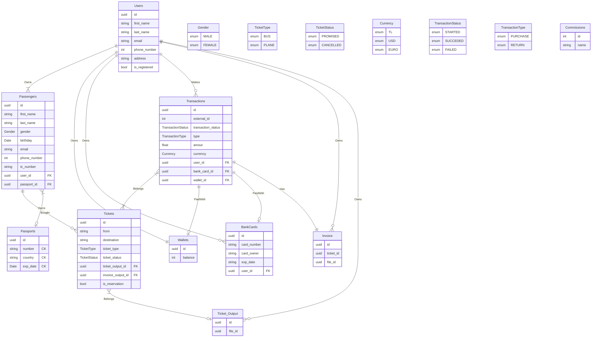

```mermaid
erDiagram
    Users ||--|{ Passengers : "Owns"
    Users ||--|| Wallets : "Owns"
    Users ||--o{ BankCards : "Owns"
    Users ||--o{ Transactions : "Makes"
    Users ||--o{ Invoice : "Owns"
    Users ||--o{ Ticket_Output : "Owns"
    Passengers ||--o{ Tickets : "Bought"
    Passengers |{--o| Passports : "Owns"

    %% multiple tickets might be handled in the same transaction
    %% a ticket might have both puschase and return transactions

    Transactions |{--|{ Tickets : "Belongs"
    Transactions ||--o| Wallets : "PaidWith"
    Transactions ||--o| BankCards : "PaidWith"
    Transactions ||--|| Invoice : "Has"

    Tickets |{--o| Ticket_Output : "Belongs"

    Gender {
        enum MALE
        enum FEMALE
    }

    TicketType {
        enum BUS
        enum PLANE
    }

    TicketStatus {
        enum PROMISED
        enum CANCELLED
    }

    Currency {
        enum TL
        enum USD
        enum EURO
    }

    TransactionStatus {
        enum STARTED
        enum SUCCEDED
        enum FAILED
    }

    TransactionType {
        enum PURCHASE
        enum RETURN
    }


    Users {
        uuid id
        string first_name
        string last_name
        string email
        int phone_number
        string address
        bool is_registered
    }

    Wallets {
        uuid id
        int balance
    }

    BankCards {
       uuid id
       string card_number
       string card_owner
       string exp_date
       uuid user_id "FK"
    }

    Transactions {
        uuid id
        int external_id
        TransactionStatus transaction_status
        TransactionType type
        float amout
        Currency currency
        uuid user_id "FK"
        uuid bank_card_id "FK"
        uuid wallet_id "FK"

    }

    Passengers {
        uuid id
        string first_name
        string last_name
        Gender gender
        Date birthday
        string email
        int phone_number
        string tc_number
        uuid user_id "FK"
        uuid passport_id "FK"
    }

    Passports {
        uuid id
        string number "CK"
        string country "CK"
        Date exp_date "CK"
    }

    Tickets {
        uuid id
        string from
        string destination
        TicketType ticket_type
        TicketStatus ticket_status
        uuid ticket_output_id "FK"
        uuid invoice_output_id "FK"
        bool is_reservation
    }

    Ticket_Output {
        uuid id
        uuid file_id
    }

    Invoice {
        uuid id
        uuid ticket_id
        uuid file_id
    }

    Commissions {
        int id
        string name
    }
```
