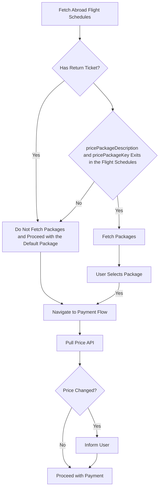

```mermaid
graph TD;
    A[Fetch Abroad Flight Schedules] --> B{Has Return Ticket?};
    B -- Yes --> C[Do Not Fetch Packages and Proceed with the Default Package];
    B --> E{pricePackageDescription and pricePackageKey Exits in the Flight Schedules};
    E -- Yes --> F[Fetch Packages];
    E -- No --> C;
    F --> H[User Selects Package];
    C --> I;
    H -- Yes --> I[Navigate to Payment Flow];
    I --> K[Pull Price API];
    K --> L{Price Changed?};
    L -- Yes --> M[Inform User];
    L -- No --> N[Proceed with Payment];
    M --> N;
```
